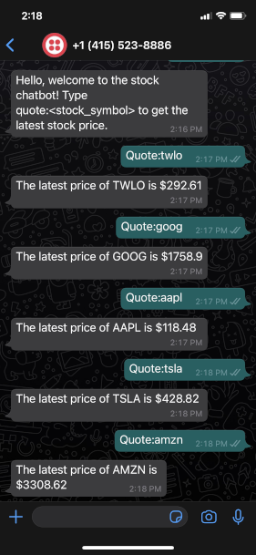

# Stock Chatbot

A chatbot using the Twilio API that gives a user the latest stock price when given a ticker symbol.

## Screenshot

<!-- Screenshot: scale image, 25% -->

## Technology Stack

- [Twilio API for WhatsApp](https://www.twilio.com/whatsapp)
- [Flask](https://flask.palletsprojects.com/)
- [marketstack API](https://marketstack.com/)

## Author

[Christopher Najafi](https://www.chrisnajafi.com/)
